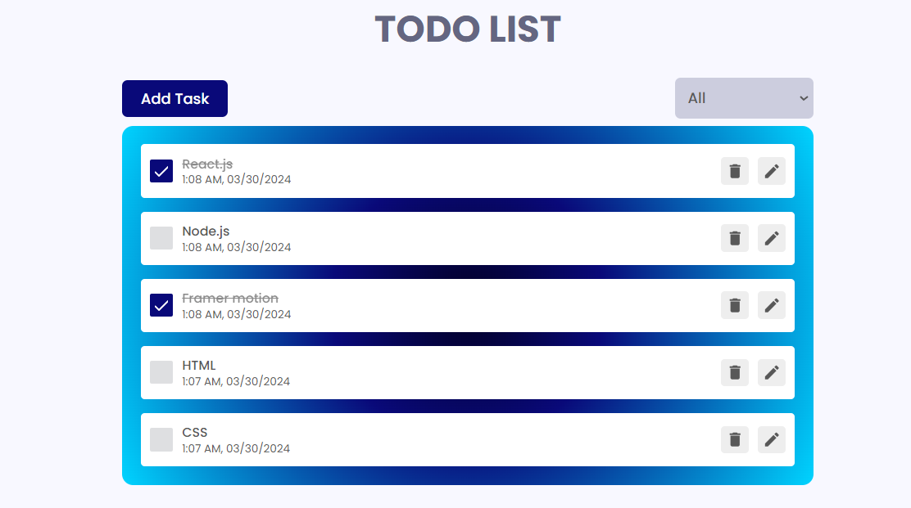
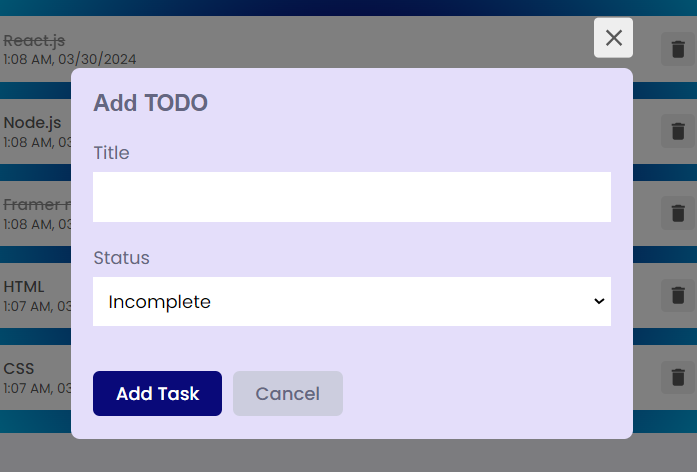

----ToDo app using react.js, redux, react hooks----

To run the project, first download the project folder from github and then run the below in the given sequence in terminal.
1. npm install
2. npm start

----Explanation of the Project----

As instructed in the assignment given, I have done every minute things with keen attention;
1. For Designing purpose, I have used CSS preprocessors, Framer-motion, React-toast.
2. I have created TaskInput and TaskList components and there I have used useState(), useEffect() as per the need for state management.
3. For CRUD activity, I used Redux Toolkit library to manage state using proper reducers and actions.
4. Added tasks are stored in localStorage, so that after refreshing they won't get vanished.
5. Bonus: I ahev added an checkbox to mark it as completion of a task without deleting it.

Extra Features:
1. I have introduced a filter button there to filter out incomplete and completed tasks.
2. I have added the update button too if in case an user enters some typo, then he can modify it.
3. Date and time are being recorded, while you add task.

----Output Pics----

----Special Note----
N.B- There is a small bug in development build, so you might get an error while starting the server. 
Solution is after failed compilation try to save package.json by pressing CTRL+S and then it will work perfectly.